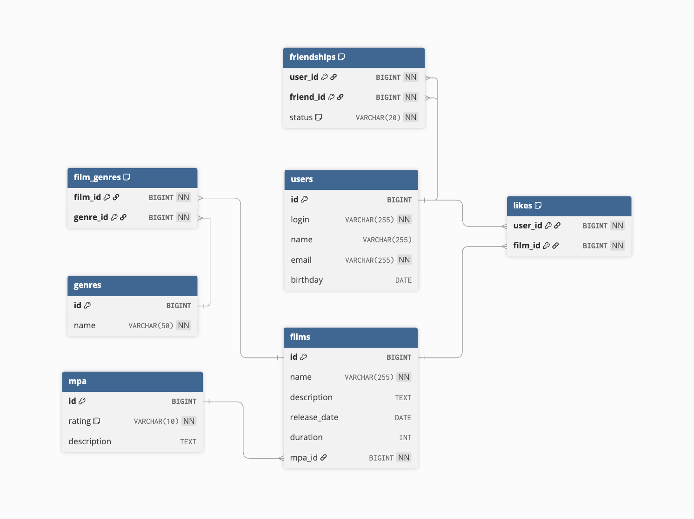

# ER Diagram for Filmorate



## Описание

Схема отражает следующие сущности и связи:

- `users` — пользователи приложения.
- `films` — фильмы.
- `genres` — жанры фильмов, связь с фильмами через `film_genres`.
- `mpa` — рейтинги Motion Picture Association, связь с фильмами через `mpa_id`.
- `likes` — лайки пользователей к фильмам.
- `friendships` — дружба между пользователями с подтверждением/неподтверждением.

Примеры SQL-запросов для приложения:

```PostgreSql
-- Получить все фильмы пользователя
SELECT f.*
FROM films f
JOIN likes l ON f.id = l.film_id
WHERE l.user_id = 123;

-- Получить топ 10 популярных фильмов
SELECT f.*, COUNT(l.user_id) AS likes_count
FROM films f
LEFT JOIN likes l ON f.id = l.film_id
GROUP BY f.id
ORDER BY likes_count DESC
LIMIT 10;

-- Получить список друзей пользователя
SELECT u.*
FROM users u
JOIN friendships f ON u.id = f.friend_id
WHERE f.user_id = 123 AND f.status = 'confirmed';

-- Получить общих друзей двух пользователей
SELECT u.*
FROM users u
JOIN friendships f1 ON u.id = f1.friend_id AND f1.user_id = 123 AND f1.status = 'confirmed'
JOIN friendships f2 ON u.id = f2.friend_id AND f2.user_id = 456 AND f2.status = 'confirmed';

-- Получить все фильмы определённого жанра
SELECT f.*
FROM films f
JOIN film_genres fg ON f.id = fg.film_id
JOIN genres g ON fg.genre_id = g.id
WHERE g.name = 'Комедия';

-- Получить все фильмы с определённым рейтингом MPA
SELECT f.*
FROM films f
JOIN mpa m ON f.mpa_id = m.id
WHERE m.rating = 'PG-13';
```